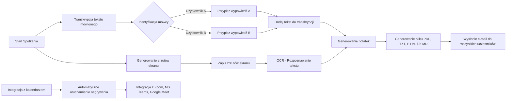
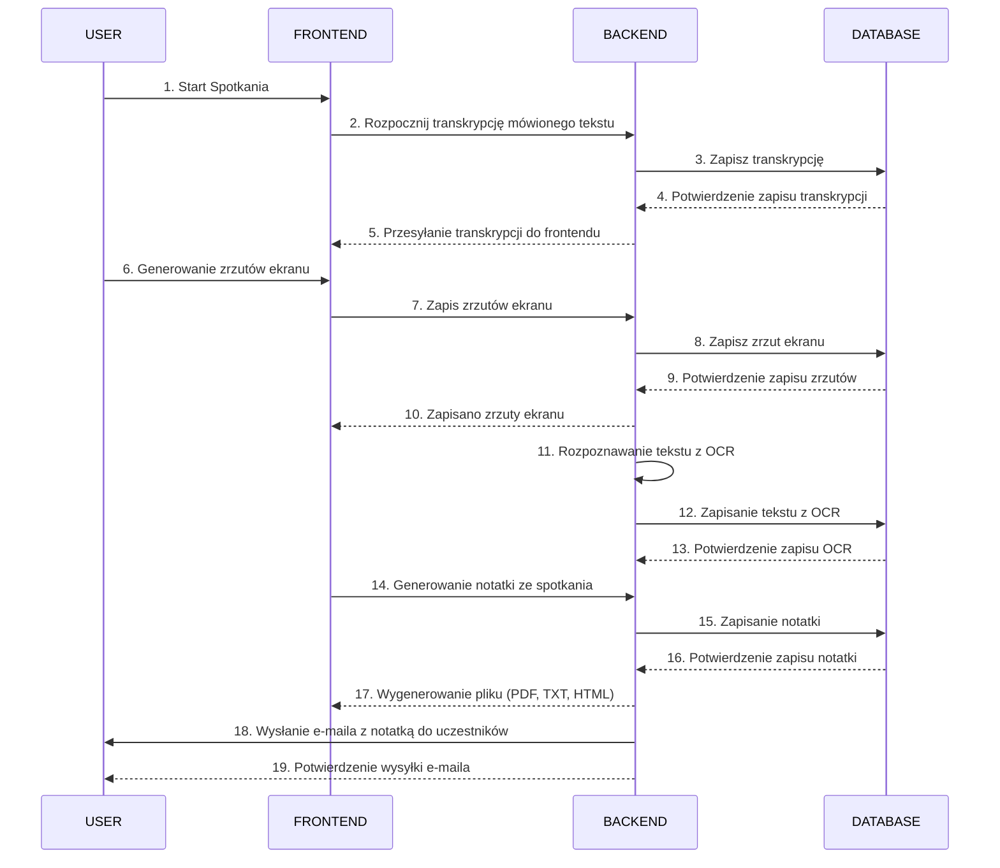

# Dokumentacja inżynierii wymagań

## Członkowie zespołu

- [Zofia](https://github.com/Zocha1)
- [Marta](https://github.com/marpom03)
- [Paweł](https://github.com/pawel-rus)

## 1. Macierz kompetencji zespołu

| Kompetencje                                             | Zofia | Marta | Paweł |
|---------------------------------------------------------|-------|-------|-------|
| Bazy Danych SQL                                         | ❌    | ✅    | ❌    |
| Bazy Danych NoSQL                                       | ❌    | ❌    | ❌    |
| Znajomość technologii AI/ML                             | ✅    | ✅    | ❌    |
| Znajomość narzędzi OCR                                  | ✅    | ✅    | ❌    |
| Znajomość PyTorch / TensorFlow                          | ✅    | ✅    | ❌    |
| Znajomość platformy Hugging Face                        | ❌    | ❌    | ❌    |
| Znajomość WebRTC                                        | ❌    | ❌    | ❌    |
| Tworzenie wtyczek do przeglądarek (Chrome, Firefox)     | ❌    | ❌    | ❌    |
| Znajomość Flask / Django                                | ❌    | ❌    | ❌    |
| Znajomość Node.js, Express.js                           | ❌    | ✅    | ❌    |
| Znajomość Java Spring                                   | ❌    | ❌    | ❌    |
| Frontend Frameworks (Vue.js, Angular, React)            | ❌    | ✅    | ❌    |
| Znajomość TypeScript                                    | ❌    | ✅    | ❌    |
| DevOps / CI/CD (GitHub Actions)                         | ❌    | ❌    | ❌    |
| Praca z chmurą (AWS, GCP, Azure)                        | ❌    | ❌    | ❌    |
| Konteneryzacja - Docker                                 | ❌    | ❌    | ❌    |
| Testowanie (unit, integracyjne)                         | ❌    | ❌    | ❌    |
| Postman (testowanie API)                                | ❌    | ❌    | ❌    |
| Praca z API do transkrypcji mowy (np. Google Cloud, AWS)| ❌    | ❌    | ❌    |
| Praca z narzędziami analitycznymi (ElasticSearch, Kibana)| ❌    | ❌    | ❌    |
| Integracja z modelami generatywnymi (ChatGPT, Gemini AI, Cloud AI) | ❌ | ❌ | ❌ |
| Integracja z kalendarzami (Google, Outlook)             | ❌    | ❌    | ❌    |
| Project Management                                      | ❌    | ❌    | ❌    |

## 2. Zestaw pytań dotyczących wymagań

| Pytanie                                          | Odpowiedź                                                                              | Uwagi                                             |
|--------------------------------------------------|----------------------------------------------------------------------------------------|---------------------------------------------------|
| Jaka ma to być aplikacja? Webowa czy Desktopowa? | Webowa lub plugin do przeglądarki.                                                     | Powinna działać niezależnie od narzędzia do telekonferencji. |
| Czy aplikacja wymaga logowania?                  | Nie wspomniano, ale jest to raczej oczywiste.                                          | Warto omówić na spotkaniu.                        |
| Ilu użytkowników będzie korzystać z aplikacji?   | Nieokreślona liczba, zakładamy wsparcie dla dowolnej liczby uczestników w spotkaniach. | Skalowalność.                                     |
| Jakie dane mają być przetwarzane?                | Transkrypcja mowy, zrzuty ekranu, treści OCR, identyfikacja mówców.                    | -                                                 |
| Jakie formaty eksportu są wymagane?              | PDF, HTML, TXT, MD.                                                                    | -                                                 |
| Jakie platformy do spotkań mają być wspierane?   | Zoom, Microsoft Teams, Google Meet.                                                    | Możliwość rozbudowy o inne platformy.             |
| Czy aplikacja powinna działać automatycznie?     | Tak, z automatycznym uruchamianiem na podstawie wydarzeń w kalendarzu.                 | Integracja z kalendarzem.                         |
| Czy raporty mają być wysyłane automatycznie?     | Tak, e-mailem do uczestników spotkania.                                                | Do omówienia dokładny system mailowy.             |
| Czy aplikacja ma identyfikować mówców?           | Tak, to opcjonalna funkcjonalność (nice to have).                                      | Może wymagać zaawansowanego przetwarzania danych. |
| Czy potrzebne są dodatkowe analizy statystyczne? | Tak, opcjonalnie analiza ilości i szybkości wypowiedzi uczestników.                    | Do omówienia z klientem.                          |

## 3. Funkcjonalności

| Funkcjonalność                      | Opis                                                                      | Uwagi                          |
|-------------------------------------|---------------------------------------------------------------------------|--------------------------------|
| Transkrypcja tekstu mówionego       | Automatyczna zamiana mowy na tekst.                                       | -                              |
| Zapis zrzutu ekranu                 | Możliwość zapisu prezentacji udostępnianej przez dowolnego użytkownika.   | -                              |
| OCR - Optical Character Recognition | Rozpoznawanie tekstu w obrazach, np. z whiteboarda.                       | -                              |
| Generowanie notatki ze spotkania    | Eksport notatek w formatach: PDF, HTML, TXT, MD.                          | -                              |
| Raport po spotkaniu                 | Automatyczne wysyłanie raportu e-mailem do uczestników.                   | SEND IN BLUE(Brevo), MARGUN    |
| Integracja z kalendarzem            | Automatyczne uruchamianie nagrywania na podstawie zaplanowanych wydarzeń. | -                              |
| Wsparcie dla platform               | Obsługa Zoom, Microsoft Teams, Google Meet.                               | -                              |
| Identyfikacja mówców                | Przypisywanie wypowiedzi do konkretnych osób.                             | Opcjonalnie - "nice to have".  |
| Podsumowanie notatek                | Wyciąganie kluczowych informacji.                                         | -                              |
| Wyszukiwanie w notatkach            | Szybkie znajdowanie konkretnych treści.                                   | -                              |
| Statystyki wypowiedzi               | Analiza ilości i szybkości wypowiedzi uczestników.                        | Opcjonalnie - "nice to have".  |

## 4. Ustalony format danych wejściowych

### Struktura bazy danych:

### Tabela: `users`:

| Kolumna       | Typ danych     | Opis                                              |
| ------------- | -------------- | ------------------------------------------------- |
| `id`          | `INT`          | Unikalny identyfikator użytkownika (klucz główny) |
| `username`    | `VARCHAR(50)`  | Nazwa użytkownika                                 |
| `password`    | `VARCHAR(255)` | Hash hasła                                        |
| `email`       | `VARCHAR(100)` | Firmowy email użytkownika                         |
| `role`        | `VARCHAR(10)`  | Rola użytkownika (`admin` albo `user`)            |

#### Przykład danych wejściowych:

| id  | username   | password                           | email                | role  |
| --- | ---------- | ---------------------------------- | -------------------- | ----- |
| 1   | admin      | $2y$10$abcdefghijkmnopqrstuvwxyz   | admin@example.com    | admin |
| 2   | jsmith     | $2y$10$lmnopqrstuvwxyzabcdefghijk  | jsmith@example.com   | user  |
| 3   | amiller    | $2y$10$zxywvutsrqponmlkjihgfedcba  | amiller@example.com  | user  |

---

### Tabela: `meetings`

| Kolumna        | Typ danych     | Opis                                                   |
| -------------- | -------------- | ------------------------------------------------------ |
| `id`           | `INT`          | Unikalny identyfikator spotkania (klucz główny)         |
| `title`        | `VARCHAR(100)` | Tytuł spotkania                                        |
| `description`  | `TEXT`         | Opis spotkania                                         |
| `start_time`   | `DATETIME`     | Data i godzina rozpoczęcia spotkania                   |
| `end_time`     | `DATETIME`     | Data i godzina zakończenia spotkania                   |
| `created_by`   | `INT`          | ID użytkownika, który utworzył spotkanie (klucz obcy) |

#### Przykład danych wejściowych:

| id  | title                 | description           | start_time           | end_time             | created_by |
| --- | --------------------- | --------------------- | -------------------- | -------------------- | ---------- |
| 1   | Spotkanie projektowe   | Omówienie postępu projektu | 2024-11-20 09:00:00 | 2024-11-20 10:00:00 | 1          |
| 2   | Spotkanie zarządu      | Dyskusja na temat strategii | 2024-11-21 11:00:00 | 2024-11-21 12:30:00 | 2          |
| 3   | Spotkanie z klientem   | Prezentacja wyników  | 2024-11-22 14:00:00 | 2024-11-22 15:00:00 | 3          |

---

### Tabela: `transcriptions`

| Kolumna          | Typ danych     | Opis                                                   |
| ---------------- | -------------- | ------------------------------------------------------ |
| `id`             | `INT`          | Unikalny identyfikator transkrypcji (klucz główny)      |
| `meeting_id`     | `INT`          | ID spotkania (klucz obcy)                              |
| `speaker_id`     | `INT`          | ID mówcy (klucz obcy do tabeli `users`)                |
| `text`           | `TEXT`         | Zapis transkrypcji tekstu                              |
| `timestamp`      | `DATETIME`     | Czas, w którym wypowiedź została zarejestrowana        |

#### Przykład danych wejściowych:

| id  | meeting_id | speaker_id | text                            | timestamp           |
| --- | ---------- | ---------- | ------------------------------- | ------------------- |
| 1   | 1          | 1          | "Witam wszystkich na spotkaniu." | 2024-11-20 09:01:00 |
| 2   | 1          | 2          | "Omówię postępy w projekcie."    | 2024-11-20 09:03:15 |
| 3   | 2          | 3          | "Chciałbym przedstawić nasze cele." | 2024-11-21 11:05:00 |

---

### Tabela: `screenshots`

| Kolumna          | Typ danych     | Opis                                                   |
| ---------------- | -------------- | ------------------------------------------------------ |
| `id`             | `INT`          | Unikalny identyfikator zrzutu ekranu (klucz główny)     |
| `meeting_id`     | `INT`          | ID spotkania (klucz obcy)                              |
| `image_url`      | `VARCHAR(255)` | URL do obrazu zrzutu ekranu                             |
| `timestamp`      | `DATETIME`     | Czas zrobienia zrzutu ekranu                            |

#### Przykład danych wejściowych:

| id  | meeting_id | image_url                            | timestamp           |
| --- | ---------- | ------------------------------------ | ------------------- |
| 1   | 1          | "https://example.com/screenshot1.png" | 2024-11-20 09:10:00 |
| 2   | 2          | "https://example.com/screenshot2.png" | 2024-11-21 11:10:00 |
| 3   | 3          | "https://example.com/screenshot3.png" | 2024-11-22 14:20:00 |

---

### Tabela: `reports`

| Kolumna         | Typ danych     | Opis                                                   |
| --------------- | -------------- | ------------------------------------------------------ |
| `id`            | `INT`          | Unikalny identyfikator raportu (klucz główny)           |
| `meeting_id`    | `INT`          | ID spotkania (klucz obcy)                              |
| `file_type`     | `VARCHAR(10)`  | Typ pliku (np. PDF, TXT, HTML, MD)                     |
| `file_url`      | `VARCHAR(255)` | URL do wygenerowanego raportu                           |
| `created_at`    | `DATETIME`     | Czas utworzenia raportu                                |

#### Przykład danych wejściowych:

| id  | meeting_id | file_type | file_url                             | created_at          |
| --- | ---------- | --------- | ------------------------------------ | ------------------- |
| 1   | 1          | PDF       | "https://example.com/report1.pdf"    | 2024-11-20 10:05:00 |
| 2   | 2          | HTML      | "https://example.com/report2.html"   | 2024-11-21 12:35:00 |
| 3   | 3          | MD        | "https://example.com/report3.md"     | 2024-11-22 15:05:00 |

---

### Tabela: `calendar_integration`

| Kolumna         | Typ danych     | Opis                                                   |
| --------------- | -------------- | ------------------------------------------------------ |
| `id`            | `INT`          | Unikalny identyfikator wpisu (klucz główny)             |
| `meeting_id`    | `INT`          | ID spotkania (klucz obcy)                              |
| `calendar_event`| `VARCHAR(255)` | Identyfikator wydarzenia w kalendarzu (np. Google Calendar) |
| `status`        | `VARCHAR(20)`  | Status integracji (np. 'Zakończono', 'W trakcie')      |

#### Przykład danych wejściowych:

| id  | meeting_id | calendar_event           | status   |
| --- | ---------- | ------------------------ | -------- |
| 1   | 1          | "event_id_12345"         | Zakończono |
| 2   | 2          | "event_id_67890"         | W trakcie |
| 3   | 3          | "event_id_54321"         | Zakończono |

## 5. Diagram przypadków użycia

## 6. Diagram sekwencyjny UML: 

### 7. Sugerowany Stack technologiczny :

    
    
    

#### Uzasadnienie wyboru technologii

**Python**
- Python to idealny wybór do realizacji funkcji związanych z rozpoznawaniem mowy oraz przetwarzaniem tekstu. Dzięki bogatemu ekosystemowi bibliotek, takim jak `SpeechRecognition` do transkrypcji mowy, `spaCy` i `NLTK` do analizy językowej, oraz `Tesseract` do rozpoznawania tekstu w obrazach (OCR), Python zapewnia szerokie możliwości w zakresie przetwarzania języka naturalnego (NLP). 

**Flask**
- Flask to lekki i elastyczny framework webowy w Pythonie, który świetnie nadaje się do budowy małych i średnich aplikacji backendowych. Jest bardziej minimalistyczny od Django, co daje większą kontrolę nad strukturą aplikacji i jej konfiguracją. Dzięki Flaskowi aplikacja może łatwiej integrować się z innymi systemami oraz dostarczać API do komunikacji z frontendem lub innymi usługami (np. Zoom, Google Meet). Flask będzie odpowiedzialny za logikę aplikacji, obsługę zapytań HTTP, zarządzanie sesjami użytkowników oraz obsługę wysyłania e-maili.

**PostgreSQL**
- PostgreSQL to relacyjna baza danych, która została wybrana ze względu na swoją niezawodność i wsparcie dla skomplikowanych zapytań. Jest w stanie przechowywać duże ilości danych (np. transkrypcji spotkań, informacje o użytkownikach, zapisy zrzutów ekranu, wyniki OCR) oraz zapewnia wysoką wydajność i bezpieczeństwo.

**Tesseract (OCR)**
- Tesseract to jedna z najlepszych bibliotek open-source do rozpoznawania tekstu w obrazach, której użyjemy do przetwarzania obrazów z tablic czy zrzutów ekranu, automatycznie ekstraktując tekst do wykorzystania w notatkach spotkań.

**SpeechRecognition (Transkrypcja Mowy)**
- `SpeechRecognition` to biblioteka Python, która pozwala na konwersję mowy na tekst. Będzie wykorzystywana do automatycznej transkrypcji spotkań, zapewniając płynne przekształcanie rozmów w tekst w czasie rzeczywistym.

**Email Integration (Send in Blue, SMTP)**
- Backend będzie obsługiwał automatyczne generowanie raportów po spotkaniach i ich wysyłanie do uczestników. Do tej funkcji użyjemy popularnych narzędzi do wysyłania e-maili, takich jak Sendinblue (Brevo) lub SMTP do wysyłania powiadomień po zakończeniu sesji.
