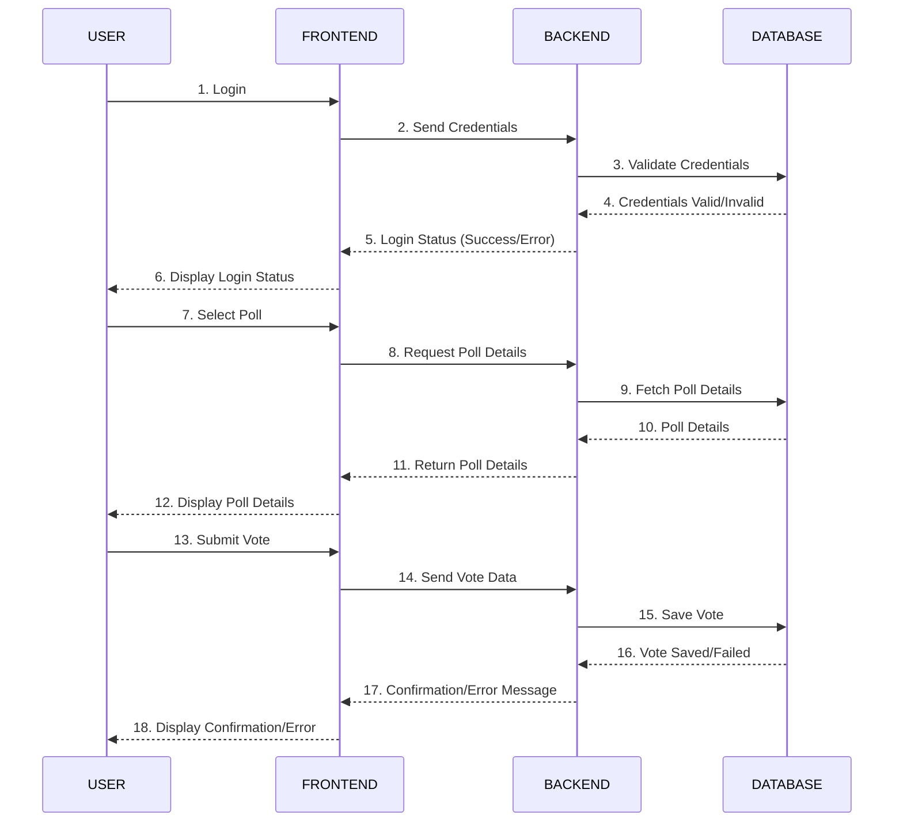

# Dokumentacja inżynierii wymagań

## Członkowie zespołu

- [Miyagi](https://github.com/Patr0sss) - Project Manager, FrontEnd Developer  
- [Paweł](https://github.com/pawel-rus) - Database Administrator, README Specialist
- [Karo(L)](https://github.com/kslowiak) - Backend Developer
- [Piotr](https://github.com/ptrthecat) - Backend Developer

## 1. Macierz kompetencji zespołu

| Kompetencje                     | Zofia | Marta | Paweł |
|---------------------------------|--------|-------|-------|
| Bazy Danych SQL                | ❌     | ❌    | ❌    |
| Bazy Danych NoSQL              | ❌     | ❌    | ❌    |
| Znajomość technologii AI/ML    | ❌     | ❌    | ❌    |
| Praca z API do transkrypcji mowy (np. Google, AWS) | ❌ | ❌    | ❌    |
| Znajomość narzędzi OCR         | ❌     | ❌    | ❌    |
| React TS                       | ❌     | ❌    | ❌    |
| Znajomość Flask / Django       | ❌     | ❌    | ❌    |
| Znajomość Node.js, Express.js  | ❌     | ❌    | ❌    |
| Znajomość Java                 | ❌     | ❌    | ❌    |
| Zarządzanie plikami i formatami dokumentów (PDF, HTML) | ❌ | ❌    | ❌    |
| Frontend Frameworks (Vue.js, Angular) | ❌     | ❌    | ❌    |
| DevOps / CI/CD (np. Jenkins, GitHub Actions) | ❌ | ❌    | ❌    |
| Praca z chmurą (AWS, GCP, Azure) | ❌    | ❌    | ❌    |
| Docker                         | ❌     | ❌    | ❌    |
| Testowanie                     | ❌     | ❌    | ❌    |
| Postman                        | ❌     | ❌    | ❌    |
| Praca z narzędziami analitycznymi (ElasticSearch, Kibana) | ❌ | ❌ | ❌ |
| Znajomość WebRTC               | ❌     | ❌    | ❌    |
| Project Management             | ❌     | ❌    | ❌    |


## 2. Zestaw pytań dotyczących wymagań

| Pytanie                                         | Odpowiedź                                                                                     | Uwagi                          |
|------------------------------------------------|---------------------------------------------------------------------------------------------|--------------------------------|
| Jaka ma to być aplikacja? Webowa czy Desktopowa? | Webowa lub plugin do przeglądarki.                                                           | Powinna działać niezależnie od narzędzia do telekonferencji. |
| Czy aplikacja wymaga logowania?                 | Nie wspomniano, ale jest to raczej oczywiste.                        | Warto omówić na spotkaniu.    |
| Ilu użytkowników będzie korzystać z aplikacji? | Nieokreślona liczba, zakładamy wsparcie dla dowolnej liczby uczestników w spotkaniach.         | Skalowalność.                 |
| Jakie dane mają być przetwarzane?              | Transkrypcja mowy, zrzuty ekranu, treści OCR, identyfikacja mówców.                          | -                              |
| Jakie formaty eksportu są wymagane?            | PDF, HTML, TXT, MD.                                                                          | -                              |
| Jakie platformy do spotkań mają być wspierane? | Zoom, Microsoft Teams, Google Meet.                                                         | Możliwość rozbudowy o inne platformy. |
| Czy aplikacja powinna działać automatycznie?   | Tak, z automatycznym uruchamianiem na podstawie wydarzeń w kalendarzu.                       | Integracja z kalendarzem.     |
| Czy raporty mają być wysyłane automatycznie?   | Tak, e-mailem do uczestników spotkania.                                                     | Do omówienia dokładny system mailowy. |
| Czy aplikacja ma identyfikować mówców?         | Tak, to opcjonalna funkcjonalność (nice to have).                                            | Może wymagać zaawansowanego przetwarzania danych. |
| Czy potrzebne są dodatkowe analizy statystyczne? | Tak, opcjonalnie analiza ilości i szybkości wypowiedzi uczestników.                          | Do omówienia z klientem.      |


## 3. Funkcjonalności

| Funkcjonalność                        | Opis                                                                                      | Uwagi                          |
|--------------------------------------|------------------------------------------------------------------------------------------|--------------------------------|
| Transkrypcja tekstu mówionego        | Automatyczna zamiana mowy na tekst.                                                      | -                              |
| Zapis zrzutu ekranu                  | Możliwość zapisu prezentacji udostępnianej przez dowolnego użytkownika.                  | -                              |
| OCR - Optical Character Recognition  | Rozpoznawanie tekstu w obrazach, np. z whiteboarda.                                      | -                              |
| Generowanie notatki ze spotkania     | Eksport notatek w formatach: PDF, HTML, TXT, MD.                                         | -                              |
| Raport po spotkaniu                  | Automatyczne wysyłanie raportu e-mailem do uczestników.                                  | SEND IN BLUE(Brevo), MARGUN   |
| Integracja z kalendarzem             | Automatyczne uruchamianie nagrywania na podstawie zaplanowanych wydarzeń.                | -                              |
| Wsparcie dla platform                | Obsługa Zoom, Microsoft Teams, Google Meet.                                              | -                              |
| Identyfikacja mówców                 | Przypisywanie wypowiedzi do konkretnych osób.                                            | Opcjonalnie - "nice to have". |
| Podsumowanie notatek                 | Wyciąganie kluczowych informacji.                                                        | -                              |
| Wyszukiwanie w notatkach             | Szybkie znajdowanie konkretnych treści.                                                  | -                              |
| Statystyki wypowiedzi                | Analiza ilości i szybkości wypowiedzi uczestników.                                       | Opcjonalnie - "nice to have". |


## 4. Ustalony format danych wejściowych

### Struktura bazy danych:

### Tabela: `users`:

| Kolumna       | Typ danych     | Opis                                              |
| ------------- | -------------- | ------------------------------------------------- |
| `id`          | `INT`          | Unikalny identyfikator użytkownika (klucz główny) |
| `username`    | `VARCHAR(50)`  | Nazwa użytkownika                                 |
| `password`    | `VARCHAR(255)` | Hash hasła                                        |
| `email`       | `VARCHAR(100)` | Firmowy email użytkownika                         |
| `role`        | `VARCHAR(10)`  | Rola użytkownika (`admin` albo `user`)            |


### Przykład danych wejściowych

Poniżej przedstawiono przykłady danych zgodnych z ustaloną strukturą bazy danych.

#### Tabela: `users`

| id  | username   | password                           | email                | role  |
| --- | ---------- | ---------------------------------- | -------------------- | ----- |
| 1   | admin      | $2y$10$abcdefghijkmnopqrstuvwxyz   | admin@example.com    | admin |
| 2   | jsmith     | $2y$10$lmnopqrstuvwxyzabcdefghijk  | jsmith@example.com   | user  |
| 3   | amiller    | $2y$10$zxywvutsrqponmlkjihgfedcba  | amiller@example.com  | user  |

## 5. Diagram przypadków użycia

```mermaid
graph LR
    A[Start Spotkania] --> B{Rozpocznij Transkrypcję}
    B -- Tak --> C[Zaczynamy nagrywanie mowy]
    B -- Nie --> D[Zakończ Transkrypcję]
    C --> E{Identyfikacja mówcy}
    E -- Użytkownik A --> F[Przypisz wypowiedź A]
    E -- Użytkownik B --> G[Przypisz wypowiedź B]
    F --> H[Dodaj tekst do transkrypcji]
    G --> H
    H --> I{Przetwórz OCR}
    I -- Tak --> J[Rozpoznaj tekst na zrzucie ekranu]
    I -- Nie --> K[Brak OCR]
    J --> L[Dodaj tekst do transkrypcji]
    K --> M[Zapisz notatki]
    L --> M
    M --> N[Generowanie raportu]
    N --> O[Generowanie plików (PDF, HTML, TXT, MD)]
    O --> P[Wysłanie raportu na e-mail]
    P --> Q[Zakończ spotkanie]

    %% Dodatkowe funkcje:
    M --> R[Przeszukiwanie notatek]
    R --> S[Filtruj po słowach kluczowych]
    S --> T[Wyświetl wyniki]
    M --> U[Analiza statystyk]
    U --> V[Oblicz ile kto powiedział]
    V --> W[Oblicz szybkość mówienia]
    W --> X[Wyświetl statystyki]

    %% Integracja z narzędziami:
    Y[Integracja z kalendarzem] --> Z[Automatyczne uruchamianie nagrywania]
    Y --> AA[Integracja z platformami (Zoom, MS Teams, Google Meet)]
    AA --> AB[Wybór platformy spotkania]
    AB --> AC[Transkrypcja działa na platformie]
    Z --> AD[Synchronizacja spotkania z kalendarzem]

```

## 6. Diagram sekwencyjny UML: 




### 7. Sugerowany Stack technologiczny :

<div style="display: flex; align-items: center; gap: 10px;">
    
     
     
</div>

#### Uzasadnienie wyboru technologii

**React**
- Jest doskonałym narzędziem do budowania interaktywnych interfejsów użytkownika, co pozwala na płynne doświadczenia dla użytkowników aplikacji webowej. 

**Node.js**
- Działa na architekturze zdarzeniowej, co pozwala na obsługę wielu jednoczesnych połączeń, idealne do aplikacji wymagających dużej wydajności.
- Użycie JavaScript zarówno po stronie klienta, jak i serwera upraszcza procesy rozwoju i umożliwia zespołowi większą elastyczność w pracy. Programiści mogą łatwiej przechodzić między front-endem a back-endem.

**PostgreSQL**
- To potężna relacyjna baza danych, która obsługuje dużą ilość danych, zapewniając wysoką wydajność i wsparcie dla zaawansowanych funkcji.