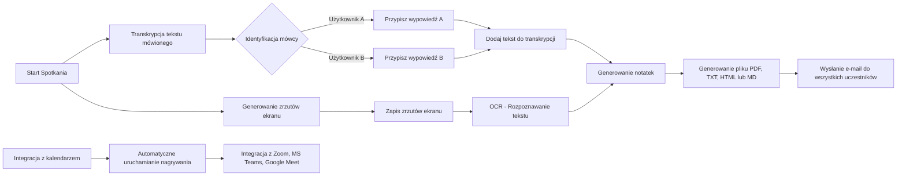
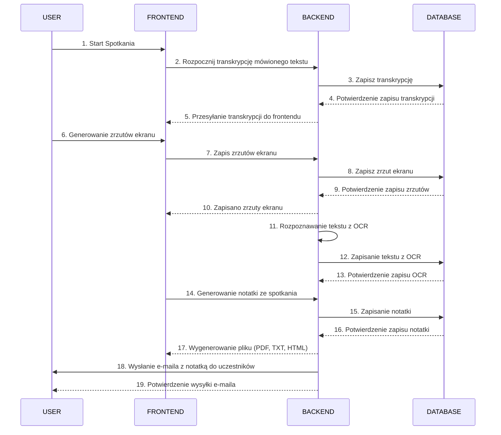

# Dokumentacja inżynierii wymagań

## Członkowie zespołu

- [Zofia](https://github.com/Zocha1)
- [Marta](https://github.com/marpom03)
- [Paweł](https://github.com/pawel-rus)

## 1. Macierz kompetencji zespołu

| Kompetencje                                             | Zofia | Marta | Paweł |
|---------------------------------------------------------|-------|-------|-------|
| Bazy Danych SQL                                         | ✅    | ✅    | ✅   |
| Bazy Danych NoSQL                                       | ❌    | ❌    | ✅   |
| Znajomość technologii AI/ML                             | ✅    | ✅    | ❌   |
| Znajomość narzędzi OCR                                  | ✅    | ✅    | ❌   |
| Znajomość PyTorch / TensorFlow                          | ✅    | ✅    | ❌   |
| Znajomość platformy Hugging Face                        | ✅    | ❌    | ❌   |
| Znajomość WebRTC                                        | ❌    | ❌    | ❌   |
| Tworzenie wtyczek do przeglądarek (Chrome, Firefox)     | ❌    | ❌    | ✅   |
| Znajomość Flask / Django                                | ❌    | ❌    | ✅   |
| Znajomość Node.js, Express.js                           | ❌    | ✅    | ❌   |
| Znajomość Java Spring                                   | ❌    | ❌    | ❌   |
| Frontend Frameworks (Vue.js, Angular, React)            | ✅    | ✅    | ❌   |
| Znajomość TypeScript                                    | ✅    | ✅    | ❌   |
| DevOps / CI/CD (GitHub Actions)                         | ❌    | ❌    | ✅   |
| Praca z chmurą (AWS, GCP, Azure)                        | ❌    | ❌    | ✅   |
| Konteneryzacja - Docker                                 | ❌    | ❌    | ✅   |
| Testowanie (unit, integracyjne)                         | ❌    | ❌    | ❌   |
| Postman (testowanie API)                                | ❌    | ❌    | ✅   |
| Praca z API do transkrypcji mowy (np. Google Cloud, AWS)| ❌    | ❌    | ❌   |
| Praca z narzędziami analitycznymi (ElasticSearch, Kibana)| ❌   | ❌    | ❌   |
| Integracja z modelami generatywnymi (ChatGPT, Gemini AI, Cloud AI) | ❌ | ❌ | ✅ |
| Integracja z kalendarzami (Google, Outlook)             | ❌    | ❌   | ❌    |
| Project Management                                      | ✅    | ❌   | ❌    |

## 2. Zestaw pytań dotyczących wymagań

| Pytanie                                          | Odpowiedź                                                                              | Uwagi                                             |
|--------------------------------------------------|----------------------------------------------------------------------------------------|---------------------------------------------------|
| Jaka ma to być aplikacja? Webowa czy Desktopowa? | Webowa lub plugin do przeglądarki.                                                     | Powinna działać niezależnie od narzędzia do telekonferencji. |
| Ilu użytkowników będzie korzystać z aplikacji?   | Nieokreślona liczba, zakładamy wsparcie dla dowolnej liczby uczestników w spotkaniach. | Skalowalność.                                     |
| Jakie dane mają być przetwarzane?                | Transkrypcja mowy, zrzuty ekranu, treści OCR, identyfikacja mówców.                    | -                                                 |
| Jakie formaty eksportu są wymagane?              | PDF, HTML, TXT, MD.                                                                    | -                                                 |
| Jakie platformy do spotkań mają być wspierane?   | Zoom, Microsoft Teams, Google Meet.                                                    | Możliwość rozbudowy o inne platformy.             |
| Czy aplikacja powinna działać automatycznie?     | Tak, z automatycznym uruchamianiem na podstawie wydarzeń w kalendarzu.                 | Integracja z kalendarzem.                         |
| Czy raporty mają być wysyłane automatycznie?     | Tak, e-mailem do uczestników spotkania.                                                | Brevo (ex Sendinblue), Margin                       |
| Czy aplikacja ma identyfikować mówców?           | Tak, to opcjonalna funkcjonalność.                                      | Może wymagać zaawansowanego przetwarzania danych. |
| Czy potrzebne są dodatkowe analizy statystyczne? | Tak, opcjonalnie analiza ilości i szybkości wypowiedzi uczestników.                    | So omówienia z klientem.           |

## 3. Funkcjonalności

| Funkcjonalność                      | Opis                                                                      | Uwagi                          |
|-------------------------------------|---------------------------------------------------------------------------|--------------------------------|
| Transkrypcja tekstu mówionego       | Automatyczna zamiana mowy na tekst.                                       | -                              |
| Zapis zrzutu ekranu                 | Możliwość zapisu prezentacji udostępnianej przez dowolnego użytkownika.   | -                              |
| OCR - Optical Character Recognition | Rozpoznawanie tekstu w obrazach, np. z whiteboarda.                       | -                              |
| Generowanie notatki ze spotkania    | Eksport notatek w formatach: PDF, HTML, TXT, MD.                          | -                              |
| Raport po spotkaniu                 | Automatyczne wysyłanie raportu e-mailem do uczestników.                   | Brevo (ex Sendinblue), Margin  |
| Integracja z kalendarzem            | Automatyczne uruchamianie nagrywania na podstawie zaplanowanych wydarzeń. | -                              |
| Wsparcie dla platform               | Obsługa Zoom, Microsoft Teams, Google Meet.                               | -                              |
| Identyfikacja mówców                | Przypisywanie wypowiedzi do konkretnych osób.                             | Opcjonalnie - "nice to have".  |
| Podsumowanie notatek                | Wyciąganie kluczowych informacji.                                         | -                              |
| Wyszukiwanie w notatkach            | Szybkie znajdowanie konkretnych treści.                                   | -                              |
| Statystyki wypowiedzi               | Analiza ilości i szybkości wypowiedzi uczestników.                        | Opcjonalnie - "nice to have".  |

## 4. Ustalony format danych wejściowych

### Struktura bazy danych:

---

### Tabela: `users`
Przechowuje informacje o użytkownikach aplikacji.

| Kolumna       | Typ danych      | Opis                                              |
|---------------|-----------------|---------------------------------------------------|
| `user_id`     | `INT`           | Unikalny identyfikator użytkownika (klucz główny) |
| `name`        | `VARCHAR(100)`  | Imię i nazwisko użytkownika                       |
| `email`       | `VARCHAR(100)`  | Adres e-mail użytkownika                          |

#### Przykład danych wejściowych:
| user_id | name             | email                |
|---------|------------------|----------------------|
| 1       | Zofia            | zofia@example.com    |
| 2       | Marta            | marta@example.com    |
| 3       | Paweł            | pawel@example.com    |

---

### Tabela: `meetings`
Przechowuje dane dotyczące spotkań.

| Kolumna         | Typ danych      | Opis                                              |
|------------------|-----------------|---------------------------------------------------|
| `meeting_id`     | `INT`           | Unikalny identyfikator spotkania (klucz główny)   |
| `title`          | `VARCHAR(255)`  | Tytuł spotkania                                   |
| `scheduled_time` | `DATETIME`      | Data i godzina zaplanowanego spotkania           |
| `platform`       | `VARCHAR(50)`   | Platforma używana podczas spotkania (np. Zoom)   |
| `created_by`     | `INT`           | ID użytkownika tworzącego spotkanie              |

#### Przykład danych wejściowych:
| meeting_id | title               | scheduled_time      | platform   | created_by |
|------------|---------------------|---------------------|------------|------------|
| 1          | Planowanie projektu | 2024-02-01 09:00:00 | Zoom       | 1          |
| 2          | Warsztat OCR        | 2024-02-02 10:00:00 | Teams      | 2          |
| 3          | Analiza AI          | 2024-02-03 11:00:00 | Meet       | 3          |

---

### Tabela: `participants`
Przechowuje relacje między użytkownikami a spotkaniami.

| Kolumna           | Typ danych      | Opis                                             |
|-------------------|-----------------|--------------------------------------------------|
| `participant_id`  | `INT`           | Unikalny identyfikator uczestnictwa (klucz główny)|
| `meeting_id`      | `INT`           | ID spotkania, w którym użytkownik uczestniczy    |
| `user_id`         | `INT`           | ID użytkownika uczestniczącego w spotkaniu       |
| `role`            | `VARCHAR(50)`   | Rola użytkownika w spotkaniu (`Host`, `Guest`)   |
| `joined_at`       | `DATETIME`      | Czas dołączenia do spotkania                     |

#### Przykład danych wejściowych:
| participant_id | meeting_id | user_id | role         | joined_at           |
|----------------|------------|---------|--------------|---------------------|
| 1              | 1          | 1       | Host         | 2024-02-01 09:00:00 |
| 2              | 1          | 2       | Participant  | 2024-02-01 09:05:00 |
| 3              | 2          | 2       | Host         | 2024-02-02 10:00:00 |
| 4              | 3          | 3       | Participant  | 2024-02-03 11:10:00 |

---

### Tabela: `transcriptions`
Przechowuje pełne dane transkrypcji ze spotkań.

| Kolumna            | Typ danych      | Opis                                              |
|---------------------|-----------------|---------------------------------------------------|
| `transcription_id`  | `INT`           | Unikalny identyfikator transkrypcji (klucz główny)|
| `meeting_id`        | `INT`           | ID spotkania, którego dotyczy transkrypcja        |
| `full_text`         | `TEXT`          | Pełna treść transkrypcji                         |
| `created_at`        | `DATETIME`      | Data i godzina wygenerowania transkrypcji        |

#### Przykład danych wejściowych:
| transcription_id | meeting_id | full_text                                     | created_at          |
|------------------|------------|-----------------------------------------------|---------------------|
| 1                | 1          | "Witamy na spotkaniu. Omówimy harmonogram..."| 2024-02-01 12:00:00 |
| 2                | 2          | "Zapraszam na warsztaty OCR. Rozpoczynamy od..." | 2024-02-02 14:00:00 |
| 3                | 3          | "Analiza modeli AI. Przedstawiamy wyniki testów..."| 2024-02-03 15:00:00 |

---

### Tabela: `screenshots`
Przechowuje zapisane obrazy ekranów ze spotkań.

| Kolumna          | Typ danych      | Opis                                               |
|------------------|-----------------|----------------------------------------------------|
| `screenshot_id`  | `INT`           | Unikalny identyfikator zrzutu ekranu (klucz główny)|
| `meeting_id`     | `INT`           | ID spotkania, w którym wykonano zrzut ekranu       |
| `image_path`     | `VARCHAR(255)`  | Ścieżka do pliku ze zrzutem ekranu                 |
| `timestamp`      | `DATETIME`      | Czas wykonania zrzutu ekranu                       |

#### Przykład danych wejściowych:
| screenshot_id | meeting_id | image_path            | timestamp           |
|---------------|------------|-----------------------|---------------------|
| 1             | 1          | /screenshots/1_01.png | 2024-02-01 09:30:00 |
| 2             | 2          | /screenshots/2_01.png | 2024-02-02 10:45:00 |
| 3             | 3          | /screenshots/3_01.png | 2024-02-03 11:20:00 |

---

### Tabela: `reports`
Przechowuje dane o wygenerowanych raportach.

| Kolumna       | Typ danych      | Opis                                              |
|---------------|-----------------|---------------------------------------------------|
| `report_id`   | `INT`           | Unikalny identyfikator raportu (klucz główny)     |
| `meeting_id`  | `INT`           | ID spotkania, którego dotyczy raport              |
| `file_path`   | `VARCHAR(255)`  | Ścieżka do pliku raportu                          |
| `format`      | `VARCHAR(10)`   | Format raportu (np. PDF, TXT, MD)                 |
| `created_at`  | `DATETIME`      | Data i godzina wygenerowania raportu              |

#### Przykład danych wejściowych:
| report_id | meeting_id | file_path             | format  | created_at          |
|-----------|------------|-----------------------|---------|---------------------|
| 1         | 1          | /reports/meeting1.pdf | PDF     | 2024-02-01 12:00:00 |
| 2         | 2          | /reports/meeting2.md  | MD      | 2024-02-02 14:00:00 |
| 3         | 3          | /reports/meeting3.txt | TXT     | 2024-02-03 15:00:00 |

---

### Tabela: `ocr`
Przechowuje wyniki analizy OCR.

| Kolumna          | Typ danych      | Opis                                              |
|------------------|-----------------|---------------------------------------------------|
| `ocr_id`         | `INT`           | Unikalny identyfikator wyniku OCR (klucz główny)  |
| `screenshot_id`  | `INT`           | ID zrzutu ekranu, którego dotyczy analiza OCR     |
| `text`           | `TEXT`          | Rozpoznany tekst                                  |
| `confidence`     | `FLOAT`         | Poziom pewności rozpoznania tekstu (0-100)        |

#### Przykład danych wejściowych:
| ocr_id | screenshot_id | text                          | confidence |
|--------|---------------|-------------------------------|------------|
| 1      | 1             | "Plan projektu"              | 98.5       |
| 2      | 2             | "Warsztaty"                  | 95.2       |
| 3      | 3             | "Analiza modeli AI"          | 96.7       |

## 5. Modelowanie systemu za pomocą tabeli i przepływ danych

| **Aktorzy**      | Użytkownik końcowy, serwer aplikacji, analityk danych      |
|-------------------|----------------------------------------------------------|
| **Opis**         | Celem działania systemu jest przetwarzanie i analizowanie danych zdalnych spotkań, takich jak transkrypcje mowy, zrzuty ekranu oraz OCR. System generuje raporty oraz podsumowania, które są automatycznie wysyłane do uczestników. |
| **Dane**         | Pliki dźwiękowe, obrazy (zrzuty ekranu, zdjęcia tablic), treść transkrypcji, dane uczestników spotkania, informacje z kalendarza. |
| **Wyzwalacz**    | Rozpoczęcie spotkania zarejestrowanego w kalendarzu lub ręczne uruchomienie nagrywania przez użytkownika. |
| **Odpowiedź**    | Raport z transkrypcją i zrzutami ekranu, statystyki wypowiedzi, podsumowanie kluczowych informacji, wykryte elementy OCR. |
| **Uwagi**        | - Wysoka dokładność OCR oraz transkrypcji.   - Możliwość przetwarzania danych dla wielu platform telekonferencyjnych (Zoom, Teams, Google Meet). |

## 6. Diagram przypadków użycia

## 7. Diagram sekwencyjny UML: 

### 8. Sugerowany Stack technologiczny :

    
    
    

#### Uzasadnienie wyboru technologii

#### **Python**  
Python został wybrany ze względu na bogaty ekosystem bibliotek wspierających kluczowe funkcjonalności projektu. SpeechRecognition umożliwi transkrypcję mowy, spaCy i NLTK posłużą do analizy językowej, a Tesseract OCR do rozpoznawania tekstu z obrazów. Python doskonale nadaje się do przetwarzania języka naturalnego (NLP) oraz integracji z systemami zewnętrznymi.

#### **Flask**  
Flask to lekki framework webowy, który umożliwia elastyczną budowę backendu. Jego prostota pozwala na szybkie tworzenie API, zarządzanie sesjami użytkowników oraz obsługę zapytań HTTP.

#### **PostgreSQL**  
PostgreSQL to niezawodna baza danych relacyjnych, która zapewnia wysoką wydajność i bezpieczeństwo. Sprawdzi się w przechowywaniu danych, takich jak transkrypcje, informacje o użytkownikach, zrzuty ekranu i wyniki OCR, wspierając zaawansowane zapytania i skalowalność systemu.
